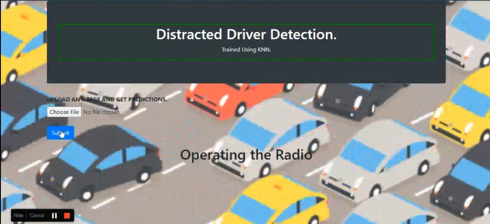

# Deployment
It is a Classifier which predicts if the Driver is Driving Safe or is Distracted.
Dataset used:- <a href="https://www.kaggle.com/c/state-farm-distracted-driver-detection" target="_blank">Dataset</a>
Model Used- KNN
Feature Extraction- HOG
Normalisation- MinMax

Note - uploaded images should be from same distribution as training images, other images might get predicted wrong prediction.

To run it in your systems:
1. `pip install flask`
2. `pip install -r requirement.txt`
3. Check for virtual environments.
4. Check for current working directory.
5. `flask run`

# Demonstration:

https://user-images.githubusercontent.com/42797562/122908713-12cba300-d372-11eb-8f1e-ce8379fa9ea2.mp4
